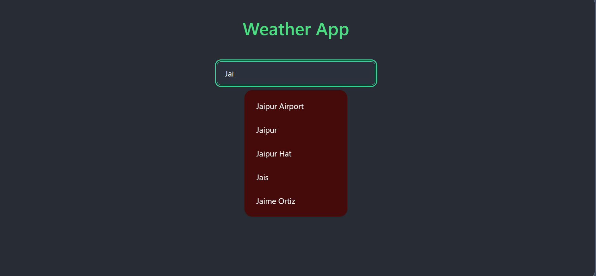
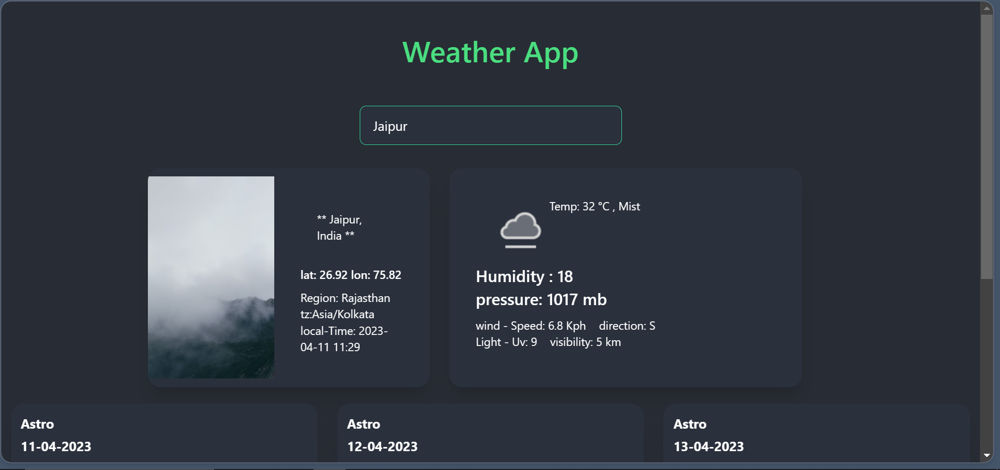
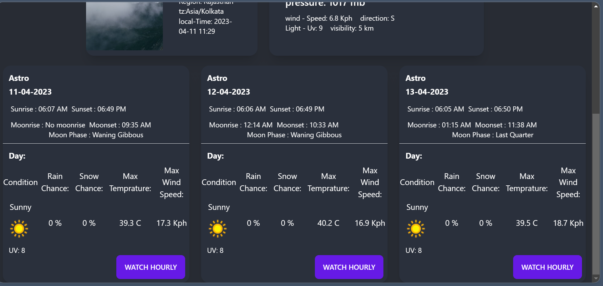
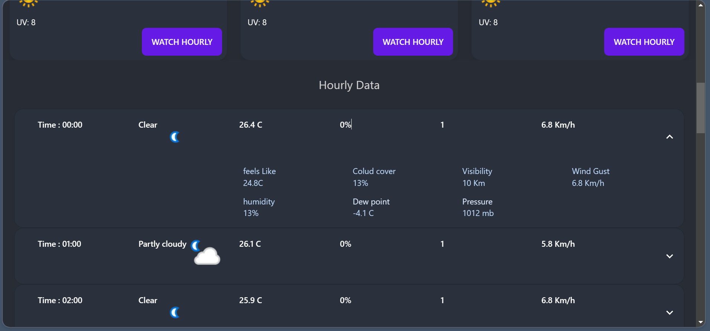

# Weather App Using React 
by- Niteh upadhayay

## Features 
<ul>
  <li>Autocomplete search 
</li>
<li>Weather Forcasting
</li>
<li>
Hourly data
</li>
<li>3 days weather details</li>
</ul>

### `How to Use`

<ol>
  <li>First clone the project to your system
</li>
<li>run <b>yarn add</b> command
</li>
<li>
after complete setup
</li>
<li>run <b>yarn start</b> </li>
<li>You can now use the app and search for weather details.</li>
</ol>

### `previews`

- ### `Autocomplete City Name`   

  

  
- ### `Over View of City`   

  
- ### `3 Days weather details`   

  
- ### `24 Hours Forcast of a particular Day`   

**Enjoy using the Weather App!**

Visit--> https://weather-app-par8-9rp98tiz4-niteshcodes.vercel.app/
